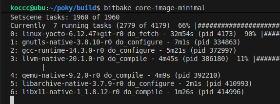
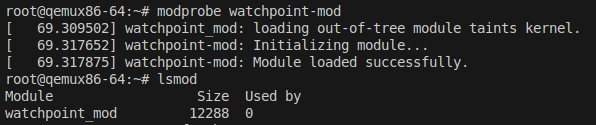

 ## Kernel Watchpoint Module
How to use:

```insmod watchpoint-mod.ko target_addr=0x12345678```

What i can do better? 

 * Muxex. Why? For more safe code, bc if 2 processes try to write new adress in sysfs causes a crash probably.  
 * Use only 1 breakpoint not 2. Why? Optimization 

--- 
This project is a simple Linux kernel module that lets you "watch" a memory address. When something in the system reads from or writes to that address, this module will print a debug message to the kernel log 
``` dmesg ```.

This guide is for those new to both Yocto and kernel dmesg development, like me ;) 
This is all the pain I went through doing this. Happy reading.

### 1 Part: What Are We Doing?

We are developing a kernel module that monitors memory and provides callbacks.

### 2 Part: Setting Up a Yocto Environment (From Scratch)

https://docs.yoctoproject.org/brief-yoctoprojectqs/index.html

### 3 Part: Adding Our Kernel Module to Yocto

Now we need to create our own "layer" to hold the recipe for our module. A layer is just a way to keep our custom stuff organized and separate from the official Yocto code.

Create a New Layer: From inside your poky/build directory, use the built-in tool to create a new layer for us.

``` bitbake-layers create-layer ../meta-custom ```

Add the Layer to the Build: Now, tell Yocto to pay attention to our new layer.

```bitbake-layers add-layer ../meta-custom```

Create the Recipe Directory: A recipe is a file that tells Yocto how to build something. We need to create a folder structure for our recipe inside our meta-custom layer.

```mkdir -p ../meta-custom/recipes-kernel/watchpoint-mod/```

#### 3.1 Copy the Files: Place the files from this project into the directory you just created.

* Copy watchpoint-mod.c to ../meta-custom/recipes-kernel/watchpoint-mod/watchpoint-mod.c

* Copy watchpoint-mod.bb to ../meta-custom/recipes-kernel/watchpoint-mod/watchpoint-mod.bb

* Tell Yocto to Build the Module: We need to add our module's name to the main image configuration file. Open conf/local.conf with a text editor (e.g., ```nano conf/local.conf``` ) and add this line to the end of the file:

```IMAGE_INSTALL:append = " watchpoint-mod"```

(Note the space at the beginning! It's important.)

#### 3.2 How to make sure you add layer:

```bitbake-layers show-layers```

You should see:
```
layer                 path                                                                    priority
========================================================================================================
...
meta-custom           /home/koccc/poky/meta-custom                                            6 
```

### 4 Part: Building and Running in QEMU

Build the Image: This is the magic step when you wait! The bitbake command will read all the recipes and build a complete, bootable Linux image from source code. This will take a long time (possibly hours) the first time you run it, as it has to download(more 40GB) and compile everything(more threads CPU better).

```bitbake core-image-minimal```



Run the Virtual Machine (QEMU): Once the build is finished, run this command to start a virtual machine with your new custom Linux OS.

```runqemu qemux86-64 slirp nodesktop```

The login is root with no password.

### 5 Part: How to watch if module loaded

Your module (watchpoint-mod.ko) should be find by command in QEMU: 

```find / -name "watchpoint-mod.ko"```

If find shows a path:

* Update module database:

```depmod -a ```

* Load module:
 
```modprobe watchpoint-mod```

s

If no you anwser, you do something wrong in Part 3

ALL DONE! Cheers for you!

### 6 Part: helpful sites

https://sysprog21.github.io/lkmpg/#introduction - How to code Kernel Module

https://docs.yoctoproject.org/brief-yoctoprojectqs/index.html - How to Yocto. Yes, just Yocto.

https://www.youtube.com/@techabyte8/playlists - How to Yocto for beginners 